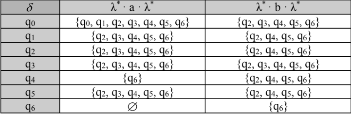
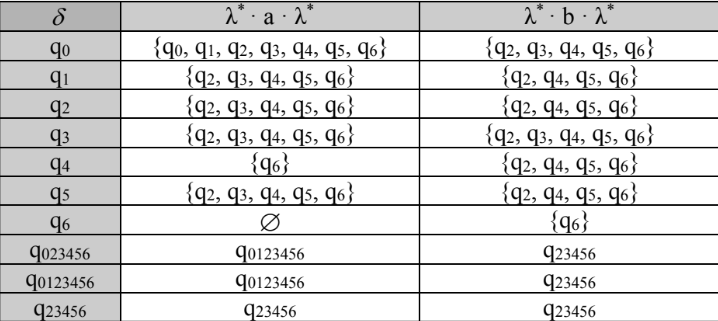

#  λ-NFA -> DFA
 
 Table of contents
1. [ Description. ](#desc)
2. [ Usage tips. ](#usage)

<a name="desc"></a>
## 1. Description

There are x steps to convert a λ-NFA to DFA :
1. **Calculate λ-closures for all states**<details>
    <summary>Code for calcualte λ-closures for all states</summary>

    ```python

        #logic : for all states, it goes for each lambda road that he finds till it's formed a lambda-closures.
        closures = {state:[] for state in states}
        i = 0
        for state in states:
            closures[state].append(states[i])
            current_state = [states[i]]
            verify = True # it will be False when there are no other roads with Lambda
            while verify:
                temp = []
                for el in current_state:
                    if  AUTO[el]['L'] != []:
                        temp.extend(AUTO[el]['L'])
                if temp == []: # if it didn't find another road with lambda
                    verify = False
                current_state = temp
                closures[state].extend(temp)
                closures[state] = list(set(closures[state])) # remove all dublicates, 
                #if we have some roads with lambda which will contribute to a cycle, then we will have an infinite while.
                # So we must take out all the dublicates before going to the next step.
            i+=1
    ```

</details>


2. **Create a λ-table**
<details>
    <summary>Code for creating the λ-table</summary>

    ```python
    #tabel l-nfa
    l_NFA = {state:{letter: [] for letter in alphabet if letter != "L"} for state in states}

    for state in l_NFA:
        for letter in l_NFA[state]:
            #λ* it's already done in closures

            #Go with all states to each letter and verify if they appear in AUTO
            for local_state in closures[state]:
                if AUTO[local_state][letter] != []:
                    l_NFA[state][letter]= union_lists(l_NFA[state][letter],AUTO[local_state][letter])
            #l*
            close_final = l_NFA[state][letter] # l* a
            temp = []
            for local_state in close_final:
                temp = union_lists(temp,closures[local_state]) 
            l_NFA[state][letter] = temp
    ```

</details>


3. **Create DFA**   
We will start with the closure of the initial state, we will have an union of all results (form the table) for each state in the closure :   
_eg. < q1,a > = [q1, q2, q3] =>   {q1, λ * a λ *} ∪ {q2, λ * a λ *} ∪ {q3, λ * a λ *}_   
If the results are not in table, then we will calculate for them aswell.
<details>
    <summary>Code for creating the DFA</summary>

    ```python
    #Create DFA
    DFA_final = {} #λ-NFA -> DFA
    DFA_final_states = []

    def create_DFA(current_state):
        litere = {}
        for letter in alphabet[1:]:
            temp = []
            for local_state in current_state:
                temp = union_lists(temp,l_NFA[local_state][letter])
            litere[letter] = sorted(temp)

        string_of_states = "".join(sorted(current_state))
        DFA_final[string_of_states] = litere

        for letter in alphabet[1:]:
            state_letter = DFA_final[string_of_states][letter]
            if "".join(state_letter) not in DFA_final:
                create_DFA(state_letter)

        for local_state in current_state: #verify if the state is final.
            if local_state in final_state:
                DFA_final_states.append(string_of_states) #add the final states
                break

    create_DFA(closures[states[0]]) #starts with the initial state
    ```
    
</details>
<br>

<a name="usage"></a>
## 2. Usage tips

In the **λ-NFA folder** you will need to have an input type text with the structure as below:   
*(there are already 3 examples there to try out)*
```text
first line : the alphabet separated by " "
L = λ

second line: all the states separated by " "
(first state is the initial state)

lines : 
state1 letter state2 (from the state1 it goes to the state2 with letter)
...
...
...

last line: final states
``` 
### Example:
```text
L a b
q0 q1 q2 q3 q4
q0 b q1
q0 L q3
q1 b q2
q2 a q1
q3 L q1
q3 b q0
q3 a q3
q3 L q2
q3 a q4
q4 b q3
q4 b q4
q4 L q2
q0
```

## Run the code:
```shell
foo@bar:~$ python3 l-NFA.py file.txt
```
**file.txt** = l-nfa file which you created previously

## Output:
1. [DFA.dot](DFA.dot) file (created as a graph scheme)
2. [DFA.png](DFA.png) image which is a visual representation of the DFA created